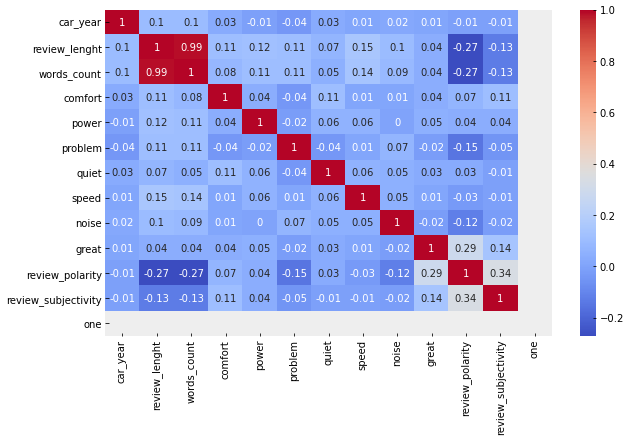
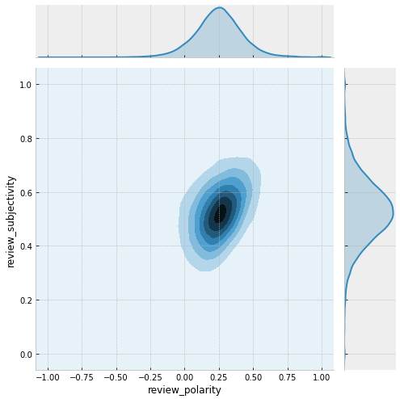
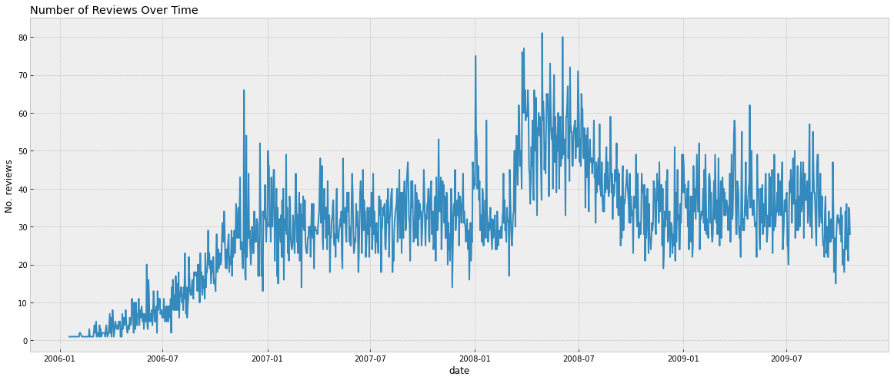

# Car Reviews Sentiment Analysis
## Overview
This is an analysis of the reviews for cars given between the years 2007 and 2009. The pourpose is to find any pattern or trends that helps understand any correlation between the sentiment expressed in a review with other factors in the data set, like car make or year, lenght of the reviews, etc.

## Resources and Credits

Original data set provider: Kavita Ganesan and ChengXiang Zhai, "Opinion-Based Entity Ranking", Information Retrieval, 2011.

This analysis was made using Python 3.7, with the libraries: numpy, pandas, matplotlib, seaborn, textblob,  nltk,  bs4 and jupyter lab.

## Getting the Data

THe data was obtained from [UCI Machine Learning Repository: OpinRank Review](https://archive.ics.uci.edu/ml/datasets/OpinRank+Review+Dataset). "This data set contains full reviews for cars and and hotels collected from Tripadvisor and Edmunds. For this analysis I am only interested on the cars reviews data.

- ### Format
The data comes in 3 folders, one for each year of the review (2007, 2008, 2009). Inside these folders are text documents one for each car, they are named with the format year_make_model. Each car information is shown in a a tag separated format, like this:
                <DOCNO>year_make_model</DOCNO>
                <DOC>
                <DATE>review_date</DATE>
                <AUTHOR>review_author</AUTHOR>
                <TEXT>textual_review</TEXT>
                <FAVORITE>favorites_features</FAVORITE>
                </DOC>
                
In order to extract this data and getting into a tabular format, BeautifulSoup from bs4 was used to extract each elemen from the tags and then a appeding them into list, one list for each element. Feeding them to pandas to convert then into one big data frame. The whole process can be seen on the script; [Get Data](get_data.py).

The new data set was save on cars_r.csv.
 

## Cleaning the Data

 There were some preprocessing that needs to be done to make this data set useful for analysis, among them:
 
 - Remove any missing value. In the previous part they were marked as the string "none".
 - Created 3 new columns by splitting year, make and model from title.
 - Created 2 columns one with the review caracthers length and the other with the number of words per review.
 
 - Using nltk an analysis was performed to discover which were the most common words used on all the reviews (it can be seen in the nlp.py file). With the results 7 of the most common words where chosen at random, and a column was created on for each word, where if the word is the review it had a 1, it shows 0 otherwise.
 
 - With the TextBlob function created 2 new columns one for polarity and another for subjectivity.
  - Polarity can be define as the negative, positive or neutral sentiment expressed in a review. It has a range from -1 to 1, while anything close to 0 is considered neutral.
  - Subjectivity measure how subjective a review is, it tries to measure how much of a comment is a personal opinion. It ranges from 0 to 1.
  
- Based on the polarity score, a new categorical column was created where a polarity equal to zero is neutral, less than zero is negative and greater than zero is positive.

- The columns author and review where removed as they don't add any usefull information by themselves.

This data was then save as post_clean_data.csv. The script can be found here: [Data Cleaning Script](clean_data.py)

## Data Exploration

  In this part I started analyzing the patterns in the data and discovering some interesting trends.
  
  Some of the exploration done:
  
  - Checking for correlations.
  
  
  
  - Looking at the distribution of all the variables.
  
  
  
  - Trying different types of variables combinations to get insights. Among others procedures.
  
  
  
  The full analysis can bee seen on the notebook [Data Exploration](Data_Exploration.ipynb)
  
 